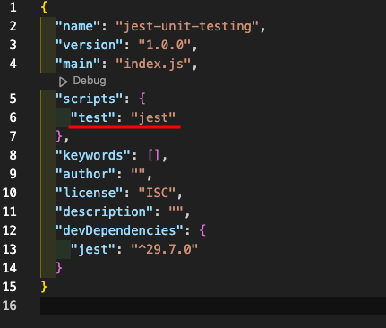

#### unit testing with jest liberary for javascript

---

using test function to test the code using TDD
concept (test driven development)

- in the test file, we create a test function
- in the test function, we create a test case
- there are multiple helper function by which we can test the code like toBe() or equal() toStrickequal() and many more
- we can also test the code using the expect function
- we can also test the code using the describe function
- we can also test the code using the it function
- we can also test the code using the beforeEach function
- we can also test the code using the afterEach function
- we can also test the code using the beforeAll function
- we can also test the code using the afterAll function
- to make a scope inside the test script we can use the describe function
- there is also a function called test.only() which is used to test only the test case which is written inside the test.only() function
- there is also a function called test.skip() which is used to skip the test case which is written inside the test.skip(). you can also use the .not.methodName to skip or nagate the test case
- there is also a function called test.todo() which is used to create a test case which is not yet implemented
- there is also a function called test.only.todo() which is used to create a test case which is not yet implemented and is only used to test the test case which is written inside the test.only()
- you can test the async code using jest by make the call back async you can handle promise and resolve and reject action by using the .resolves and .rejects method
- you can also test the async code using jest by make the call back async you can handle promise and resolve and reject action by using the .resolves and .rejects method

**installation:**

```bash
npm install jest --save-dev/-D
```

```bash
npm install jest-cli --save-dev/-D
```

**running the test:**

```bash
 npm test
```

#### edit the package.json file and add the following code in the scripts section

- `'test': 'jest'`

  

**you can also use the following command to run the test:**

> we can also use this for react testing library

> we can also use this for next babel testing library

\*_**Happy Coding**_
